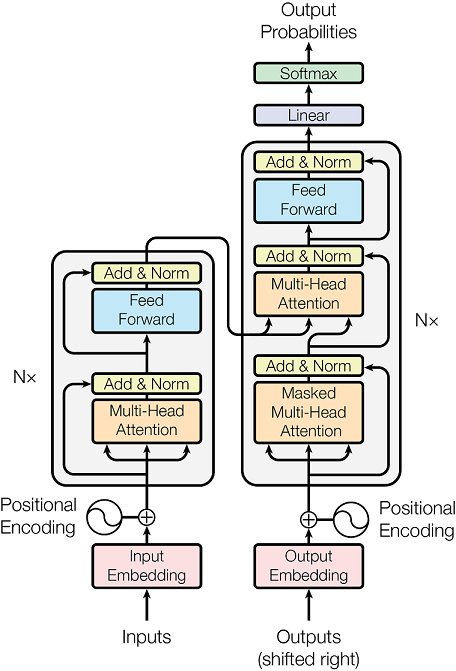

# 原理

本文主要详细介绍模型的的整个训练和推理过程。

本文将假设您对深度学习和 NLP 的相关概念有基本的了解，包括反向传播、损失函数、评估函数、常见网络层、分词、词向量等概念。

## 将文本转化为 token 序列

现在有一对中英文文本：

```text
Hello world!
你好，世界！
```

Transformers 模型的输入需要的是 token 序列。

一个简单的做法是：

1. 分词

    英文的分词十分简单，只需要按照空格分词即可。
    
    中文的分词有很多种，这里以最简单的逐字分词为例。

    ```python
    ["Hello", "world", "!"]
    ["你", "好", "，", "世", "界", "！"]
    ```

2. 构建词典

    将所有的文本分词结果统计起来，构建一个包含所有词的集合，然后对每个词进行编号即可得到词典。

3. 将词序列转化为 token 序列

    根据前面的得到的词典，把每个词替换成其编号，那么就得到了我们需要的 token 序列

    ```python
    [23, 26, 29]
    [35, 84, 62, 42, 52, 93]
    ```

事实上，分词的效果和词典的构建对于最终的结果有比较大的影响，我们可以找到现成的方案来进行完成分词和转化为 token 序列的工作，而无需我们自己进行构建词典。

本项目采用的是 bert-base-multilingual-cased 模型的分词器，它能对多种语言进行分词，但准确来说，它划分得到的 token 是词素而不是词，它比单词和汉字的粒度更细，你可以打开其 tokenizer.json 文件查看它的词典。

Transformers 模型的注意力机制能很有效地捕获上下文的联系信息，使得即便 token 的粒度很细，依然能有效获取到文本的语义信息。

## 数据集预处理

数据集采用的是 AI Challenger 的数据集，其中包含 1000 万条日常生活常用的中英文短句。

```text
一对丹顶鹤正监视着它们的筑巢领地
一对乌鸦飞到我们屋顶上的巢里，它们好像专门为拉木而来的。
一对乖乖仔开着老爸的车子。
```

```text
A pair of red - crowned cranes have staked out their nesting territory
A pair of crows had come to nest on our roof as if they had come for Lhamo.
A couple of boys driving around in daddy's car.
```

预处理要做的工作就是将每个文本使用前面提到的方法将其转化为等长的 token 序列，然后还需要为 token 序列添加一些特殊 token。

特殊的 token 有四种：&lt;bos&gt;、&lt;eos&gt;、&lt;pad&gt;、&lt;unk&gt;，它们都有自己的编号，在 **parameter.py** 中进行指定，且和 bert-base-multilingual-cased 的词典中的编号不冲突。

* &lt;bos&gt; 标识文本的开头。
* &lt;eos&gt; 标识文本的结束（位于 pad_token 之前）
* &lt;pad&gt; 标识文本中填充的部分（位于 eos_token 之后）
* &lt;unk&gt; 标识文本中未知的字词

bos_token 和 eos_token 处理用于辅助 Transformers 模型的训练和推理，后面会更加详细的解释它们。

pad_token，在模型训练中，往往是分批次进行训练，需要对多条文本生成的 token 序列的长度进行统一，对于过长的 token 序列需要进行截断，对过短的 token 序列则需要用 pad_token 填充，后面会解释 Transformers 模型如何忽略它们。

unk_token，前面提到词转化为 token 要依赖于词典，词典并不总是包含所有的词，对于冷门的词汇，它们不包含在词典中，就需要用 unk_token 来代替它们

这部分的处理在 **process_data.py** 中完成。

## 模型的训练流程

我们要进行的翻译是英译中，我们称英文文本生成的 token 序列为源序列 src，中文文本生成的 token 序列为目标序列 tgt

下面将以一个 src 序列和一个 tgt 序列为例子解释训练过程。

```python
# src
[101, 1, 2, 3, 4, 102]
# tgt
[101, 5, 6, 7, 8, 102]
```

对于它们可以轻松构造出以下几个有着明显规律的序列

```python
#src
[101]
[101, 1]
[101, 1, 2]
[101, 1, 2, 3]
[101, 1, 2, 3, 4]
# tgt
[101, 5]
[101, 5, 6]
[101, 5, 6, 7]
[101, 5, 6, 7, 8]
[101, 5, 6, 7, 8, 102]
```

模型训练时要做的就是进行如下的预测

```python
[101]             -> [101, 5]
[101, 1]          -> [101, 5, 6]
[101, 1, 2]       -> [101, 5, 6, 7]
[101, 1, 2, 3]    -> [101, 5, 6, 7, 8]
[101, 1, 2, 3, 4] -> [101, 5, 6, 7, 8, 102]
```

由上面的预测方式可以得知 &lt;bos&gt; 的作用，我们发现在 src 转化序列出来的第一行是需要一个首 token 的，这个 token 无法参与训练的过程，而&lt;bos&gt;就起到占位的作用，避免原 token 序列的首个 token 永远无法训练到。

已知上面的 src 序列和 tgt 序列的长度为6，假设词典的大小为12，那么模型输出的就是一个 (5,12) 的张量

它的每一行对应了除开头的 token 以外的每个 token

它的一行的每个值对应了词典每个词，经过 softmax 层后，其每个元素的值可以解释为该位置上是这个词的概率（这要求词典是有序的）。

假设词典的内容如下（xxx代表原本的词）

```python
sorted_dic = {
   "xxx": 1,
   "xxx": 2,
   "xxx": 3,
   "xxx": 4,
   "xxx": 5,
   "xxx": 6,
   "xxx": 7,
   "xxx": 8,
   "<bos>": 101,
   "<eos>": 102,
   "<pad>": 0,
   "<unk>": 100,
}
```

那么模型的输出可能是这样的：

```python
out = [[0.01, 0.01, 0.01, 0.01, 0.9, 0.01, 0.01, 0.01, 0.01, 0.01, 0.01, 0.01],
       [0.01, 0.01, 0.01, 0.01, 0.01, 0.9, 0.01, 0.01, 0.01, 0.01, 0.01, 0.01],
       [0.01, 0.01, 0.01, 0.01, 0.01, 0.01, 0.9, 0.01, 0.01, 0.01, 0.01, 0.01],
       [0.01, 0.01, 0.01, 0.01, 0.01, 0.01, 0.01, 0.9, 0.01, 0.01, 0.01, 0.01],
       [0.01, 0.01, 0.01, 0.01, 0.01, 0.01, 0.01, 0.01, 0.01, 0.9, 0.01, 0.01]]
```

至此，模型应该如何计算loss来进行梯度下降是非常显而易见了，这里就不再赘述了。

## 再探模型的训练流程

在[这里](https://arxiv.org/abs/1706.03762)你能找到 Transformers 的原论文——Attention Is All You Need

模型的左侧是编码器（Encoder），右侧是解码器（Decoder）



你会发现有两个输入，而且有一个输入是output，这是因为 Transformers 除了要处理输入，还要处理上下文。

在翻译任务中，输入就是指 src 序列，上下文就就是指已经翻译出来的部分 out 序列。

以 "Hello world!" 为例，假设目前正在翻译词语 "world"，那么上下文指的就是已经翻译好的文本 "你好，"

如果你了解 encoder 和 decoder 的原理，应该知道 src 序列实际上是 Encoder 的输入，Encoder 会输出隐含 src 序列丰富语义信息的张量，传递给 Decoder ，而 Decoder 还会接受已经翻译的部分 out 序列，同样得到隐含部分 out 序列丰富语义信息的张量，综合两者得到下一个词语。

## Teacher Forcing

我们会发现这样一个问题，一个文本后续的词语翻译要依赖于前面的词语的翻译结果，无法并行计算，严重影响了训练的速度，Teacher Forcing 策略能解决这个问题。

Teacher Forcing 原理就是把截取 tgt 序列一部分当作是已经翻译好的部分 out 序列，将其输入到模型当中，这样模型就可以并行的进行训练文本的每个部分。

但在实际的模型中，tgt 序列会整个送入到模型当中，因此需要屏蔽某一部分的，这就是 tgt_mask 的作用。

## 模型的推理

模型的推理和训练的区别在于，我们没有 tgt 序列输入到模型当中，只能按照前面提到非 Teacher Forcing 的步骤来进行。

在一开始 out 序列只由一个 &lt;bos&gt; 组成，将其和 src 序列一同输入到模型中，得到第一个非特殊 token，将其拼接到 out 序列后面，重复上述操作，直至推理得到 &lt;eos&gt; （这就是 &lt;eos&gt; 的作用）

## 最后

至此，关于本项目对 Transformers 模型的应用原理介绍就到此为止了。更多的训练细节和模型结构可以在代码及注释中找到，后续有机会使用 PyTorch 提供的层来重新构建 Transformers 模型，进一步细化地分析 Encoder 和 Decoder 的数据流动过程。
